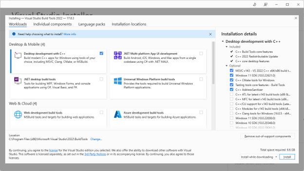
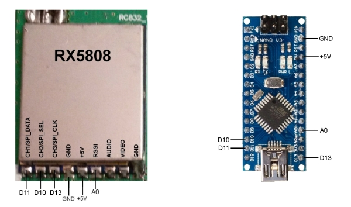
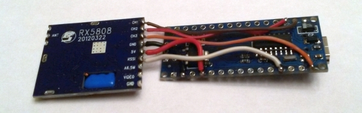
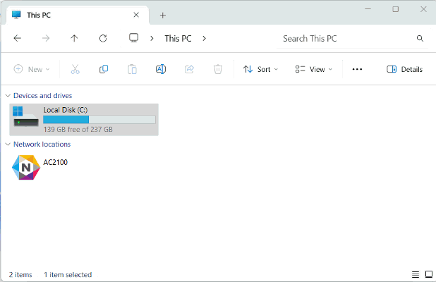

# **Windows RotorHazard Install**&#x20;

The RotorHazard server may be run on any computer with an operating system that supports Python. In these alternate configurations, one or more hardware nodes may be connected via USB -- see [doc/USB Nodes.md](https://github.com/RotorHazard/RotorHazard/blob/v4.0.0/doc/USB%20Nodes.md) for more information. The server may also be run using simulated (mock) nodes.

Some Prerequisites

1. If the computer does not already have Python installed, download and install Python from <https://www.python.org/downloads/windows/>. For RotorHazard 4.0.0 you **MUST INSTALL** Python **3.11.7** (or earlier)  The minimum version of Python needed for RotorHazard is 3.7. To check if Python is installed and the version, open up a command prompt and enter \[python –version]  If you installed Python 3.12 you might get errors
2. The next thing you will need to install is the [Visual Studio Installer](https://aka.ms/vs/17/release/vs_BuildTools.exe).  In the Workloads tab on the top make sure and check “Desktop Development with C++ and install that.
   


3. You will also need a USB Node, see [doc/USB Nodes.md](https://github.com/RotorHazard/RotorHazard/blob/v4.0.0/doc/USB%20Nodes.md) for more information.
   

4. Or you can use the PCB board I designed.  Download the gerber file [here](files/Gerber_PCB_Final_2023-12-11.zip "download").


5.  Once you have your USB Node, plug it in your computer, go to the device manager and make note of the com port (you'll need it later)


**Install the RotorHazard server on Windows:**

6. From the RotorHazard [Releases page on github](https://github.com/RotorHazard/RotorHazard/releases), download the "Source code (zip)" file.
7. Unzip the downloaded file into a directory (aka folder) on the computer.  I suggest C:\Users\\{username}\\
8. Open up windows file explorer and navigate to where you unzipped the RotorHazard server I suggest C:\Users\\{username}\RotorHazard\ directory then click in the address bar and type “cmd” it will open a command prompt in the correct directory.



9. Activate the Python virtual environment 'venv'
```
python -m venv venv
```
```
venv\Scripts\activate.bat
```
10.  Using the command prompt, navigate to the src/server directory.
```
cd src\server
```
11.  Install the RotorHazard server dependencies using the 'reqsNonPi.txt' file, using the command below. (Note that this command may require administrator access to the computer, and the command may take a few minutes to finish).

```
python -m pip install -r reqsNonPi.txt
```

12. Copy Config File

In the "src/server" directory, copy the config-dist.json file to config.json:

```
copy config-dist.json config.json
```

13.  Edit the Config file

You can open up notepad with a command to edit the config.json file.

```
notepad config.json
```

Edit the config.json file and modify the ADMIN\_USERNAME and ADMIN\_PASSWORD values. These are the login credentials you will need to enter (in the browser popup window) to access the pages reserved for the race director (i.e., the Settings and Run pages).

The attached USB node will be referenced with a serial port name like "COM3". The current ports may be viewed in the Windows Device Manager under "Ports (COM & LPT)" -- when the USB node is plugged in, its entry should appear. It may be necessary to install or update its driver (named something like "USB-SERIAL"). The "src/server/config.json" file should contain an entry like this:

```
	"SERIAL_PORTS": ["COM3"],
```
Multiple USB nodes would be configured like this:

```
	"SERIAL_PORTS": ["COM3","COM4"],
```
14.  save the config.json file
    
**Create a shortcut to start the RotorHazard server in Windows:**

1.  Right click on the desktop and choose new shortcut
2.  For the location of the item copy and paste this but change your {username}.
```
C:\Windows\System32\cmd.exe /K "cd C:\Users\{username}\RotorHazard\ && python -m venv venv && venv\Scripts\activate.bat && cd src\server && server.py
```
3.  Click Next
4.  Give your shortcut a name, maybe RotorHazard
5.  Click Finish
Your shortcut should be created, but the icon will just be a black cmd box.  Let's fix that
6.  Right Click on your shortcut and select properties
7.  Click the button that says change icon
8.  Click browse
9.  Navigate to C:\Users\{username}\RotorHazard\src\server\static\image\favicon.ico
10.  Click OK

**To stop the RotorHazard Server**

1.  In the cmd window press ctrl + c
    
**Update an existing RotorHazard server on Windows:**

1.  From the RotorHazard Releases page on github, download the "Source code (zip)" file.  https://github.com/RotorHazard/RotorHazard/releases
2.  Unzip the downloaded file into the RotorHazard directory (aka folder) on the computer, overwriting the existing version.  I suggest C:\Users\{username}\
3.  Using the command prompt, navigate to the topmost RotorHazard directory.
4.  Activate the Python virtual environment 'venv'
```
python -m venv venv
```
```
venv\Scripts\activate.bat
```
5.  Using the command prompt, navigate to the src/server directory.
```
cd src\server
```

6.  Enter the update command:
```
python -m pip install --upgrade --no-cache-dir -r reqsNonPi.txt
```
